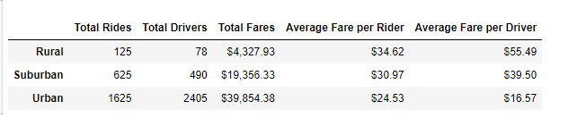
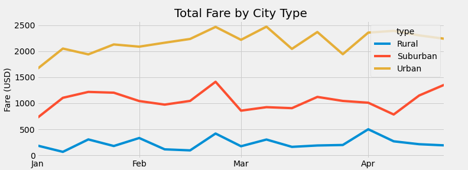

# pyber_analysis_UT_class
Analyze all the rideshare data from January to early May of 2019 and create a compelling visualization for the Pyber CEO, V. Isualize.

## Project Overview
V. Isualize has given us a brand-new assignment. Using our Python skills and knowledge of Pandas, we’ll create a summary DataFrame of the ride-sharing data by city type. Then, using Pandas and Matplotlib, we’ll create a multiple-line graph that shows the total weekly fares for each city type. Finally, we’ll submit a written report that summarizes how the data differs by city type and how those differences can be used by decision-makers at PyBer.

## Resources
- Data Source:
   - [city data (csv)](resources/city_data.csv)
   - [ride data (csv)](resources/ride_data.csv)
- Software:
   - Python 3.7.6
   - Jupyter Notebook 6.3.0

## Results
#### Summary of Data
   - The given data was broken down and aligned by city type, `Rural, Urban, Suburban`. This allowed for analysis on key metrics within each city type.
       - Total Rides
       - Total Drivers
       - Total Fares
       - Average Fare per Rider
       - Average Fare per Driver
   This data can be seen summarized below.
   
   - [Pyber Data Summary (png)](analysis/pyber_challenge_fig1.png)
#### Data Visualized 
   
   - [Fare by City Type (png)](analysis/PyBer_fare_summary.png)

Analyzing the above data and visulizations, we can clearly see a couple differences between the three city types.
   - The number of rides in Urban cities was nearly 3x more than that of Suburban and 13x more than Rural cities
   - The number of drivers within Urban cities was more than 4x that of  Suburban and 30x more than Rural cities
Though the number of drivers and rides within Urban cities so massively out performed those within Rural cities, an interesting trend is seen when analyzing the Average Fare of these rides and the Average Fare per driver within these city types.
   - Rural rides cost on  average 1.4x more than Urban rides, and 1.1x more than Suburban rides. **This leads to a signifcant increase in average fare that a driver an expect to receive within a Rural city, over that of both Suburban and Urban cities.**

When fare amounts (summed by week) are plotted over time we can see:
   - Fares in all city types are expected to increase during the weekend of President's Day.
   - Urban Cities an increase in Fares during St. Patrick's Day in March, while both Rural and Suburban do not see as high of an increase.

## Summary
Based on the above data analysis, we recommend the following steps to address disparities among the city types.
   - Incentivize drivers within Rural cities inorder to increase the driver pool, and decrease fares for Rural city riders. 
   - Incentivize riders during long weekends and known event dates, especially in Rural and Suburban areas.
   - Potentially cap the number of drivers within cities to reflect the population, so that the pool of drivers doesn't increase far beyond where a given city's demand can support.
   